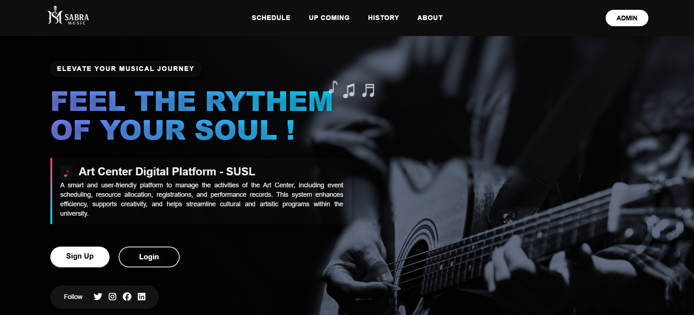

# Sabra Music - Art Center Digital Platform



**SUSL Art Center Management System**

A smart and user-friendly platform to manage the activities of the Art Center, including event scheduling, resource allocation, registrations, and performance records. This system enhances efficiency, supports creativity, and helps streamline cultural and artistic programs within the university.

---

## 🎵 Features

- **User Authentication System**
  - Student registration with email and index number
  - Secure login with index number and password
  - Admin panel access
  
- **Music Resource Management**
  - Practice room booking
  - Equipment scheduling
  - Resource allocation tracking
  
- **Event Management**
  - Performance scheduling
  - Event registration
  - Booking history tracking
  
- **User Dashboard**
  - Personal booking history
  - Upcoming schedules
  - Profile management

---

## 🛠️ Technologies Used

### **Frontend**
- **HTML5 & CSS3** - Structure and styling
- **Laravel Blade** - Templating engine for dynamic views
- **JavaScript** - Interactive UI elements and client-side logic
- **Font Awesome** - Icons and visual enhancements

### **Backend**
- **Laravel (PHP Framework)** - MVC architecture, routing, and authentication
- **PHP** - Server-side programming language

### **Database**
- **MySQL** - Relational database management system
- **Eloquent ORM** - Laravel's Object-Relational Mapping for database interactions

---

## 📋 Prerequisites

Before running this project, make sure you have:

- PHP >= 8.0
- Composer
- MySQL
- Node.js & NPM (optional, for asset compilation)

---

## 🚀 Installation

1. **Clone the repository**
   ```bash
   git clone https://github.com/yourusername/sabra-music.git
   cd sabra-music
   ```

2. **Install dependencies**
   ```bash
   composer install
   ```

3. **Environment setup**
   ```bash
   cp .env.example .env
   php artisan key:generate
   ```

4. **Database configuration**
   Update your `.env` file with database credentials:
   ```env
   DB_CONNECTION=mysql
   DB_HOST=127.0.0.1
   DB_PORT=3306
   DB_DATABASE=sabra_music
   DB_USERNAME=your_username
   DB_PASSWORD=your_password
   ```

5. **Run migrations and seeders**
   ```bash
   php artisan migrate
   php artisan db:seed
   ```

6. **Start the development server**
   ```bash
   php artisan serve
   ```

---

## 👥 Default Login Credentials

### **Student Login**
- Index No: `IS001`
- Password: `password123`

### **Admin Login**
- Email: `admin@example.com`
- Password: `password`

---

## 📁 Project Structure

```
sabra-music/
├── app/
│   ├── Http/Controllers/
│   │   └── AuthController.php
│   └── Models/
│       └── User.php
├── database/
│   ├── migrations/
│   └── seeders/
├── resources/
│   └── views/
│       ├── home.blade.php
│       ├── login.blade.php
│       ├── signup.blade.php
│       ├── booking.blade.php
│       ├── schedule.blade.php
│       └── history.blade.php
├── routes/
│   └── web.php
└── public/
    ├── images/
    └── css/
```

---

## 🔐 Authentication System

The application uses a custom authentication system with the following features:

- **Registration**: Users can sign up with email, index number, and password
- **Login**: Authentication using index number and password
- **Session Management**: Secure session handling with remember me functionality
- **Middleware Protection**: Protected routes for authenticated users only
- **CSRF Protection**: All forms include CSRF tokens for security

---

## 📊 Database Schema

### Users Table
- `id` (Primary Key)
- `name` (String)
- `email` (String, Unique)
- `index_no` (String, Unique)
- `password` (Hashed)
- `remember_token`
- `created_at` / `updated_at`

---

## 🎯 Usage

1. **Home Page**: Welcome page with platform information
2. **Sign Up**: New users can register with their university details
3. **Login**: Existing users can access their accounts
4. **Dashboard**: View personal bookings and schedules
5. **Booking**: Reserve practice rooms and equipment
6. **Schedule**: View available time slots
7. **History**: Track past bookings and activities

---

## 🤝 Contributing

1. Fork the repository
2. Create a feature branch (`git checkout -b feature/amazing-feature`)
3. Commit your changes (`git commit -m 'Add some amazing feature'`)
4. Push to the branch (`git push origin feature/amazing-feature`)
5. Open a Pull Request

---

## 📝 License

This project is developed as part of IS4102 Web Application Development course at Sabaragamuwa University of Sri Lanka.

---

## 📞 Contact

- **Developer**: [Your Name]
- **Email**: [your.email@example.com]
- **University**: Sabaragamuwa University of Sri Lanka
- **Course**: IS4102 - Web Application Development

---

## 🙏 Acknowledgments

- Sabaragamuwa University of Sri Lanka Art Center
- IS4102 Web Application Development Course
- Laravel Framework Community

---

*© 2025 | Sabra Music | All Rights Reserved*